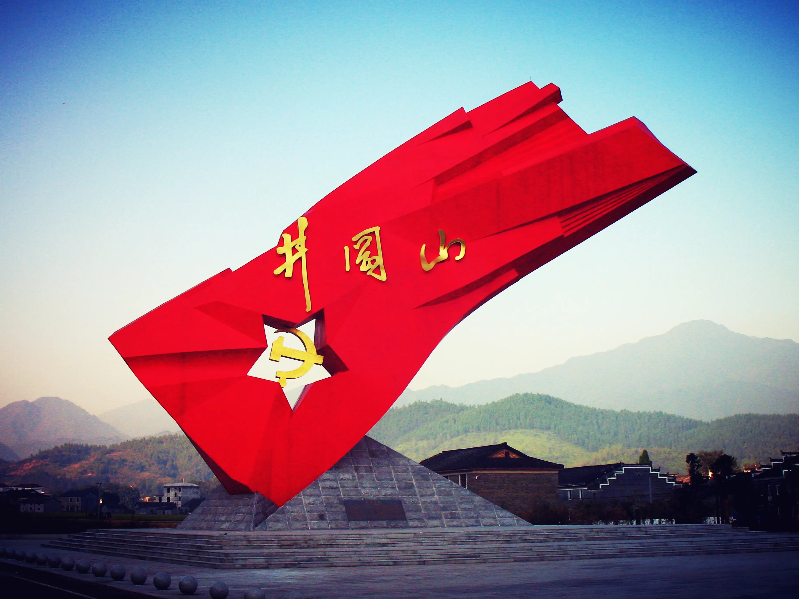

# 故事的开始

码字记录时代，文章沉淀历史。
我是大海中一朵小浪花，随波逐流，看云起云落，星辰出没。
江山如画，一时间多少豪杰。

---

作者 : 天驱 · 练剑
标签 : 开发随笔
日期 : 2019-10-11 06:16:56

------

**命运的神奇，在于未来不可知。**

1928年，井冈山被国民党围剿，伤亡惨重，林彪看不到希望，问毛泽东「红旗到底打得多久？」。

这时候的他，猜不到一九四九年的开国大典。

1969年，《中国共产党章程》破天荒地写入 : 「林彪同志是毛泽东同志的亲密战友和接班人」。

林彪兴致勃勃、意气风发地重游井冈山，提诗填词。

> 四十年前旧地，万千往事萦怀，英雄烈士没蒿莱，生死艰难度外。
> 志壮坚信马列，岂疑星火燎原，辉煌胜利共开颜，斗志不容稍减。

这时候的他，猜不到两年之后，他的故事在外蒙古大草原飞机坠毁中戛然而止。

**命运的神奇，在于彼此相交织。**

2018年，香港渣男在台湾杀害女友。

随后，一系列风波接踵而至。

蝴蝶效应般导致2019年中国封杀NBA。

---

看不透的命运，猜不到的结局。

你的故事，我的故事，我们的故事。

写写字，记录我们亲历的历史。

